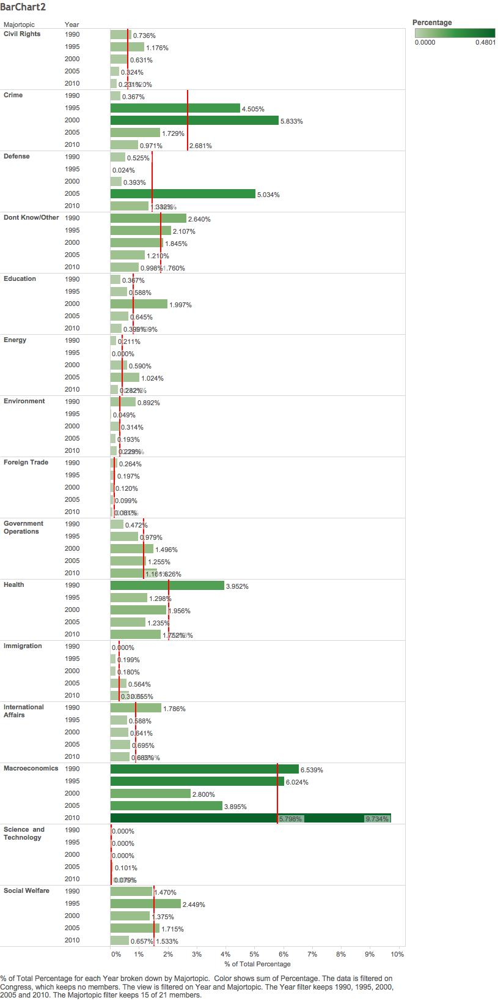
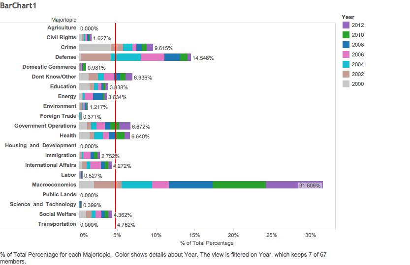
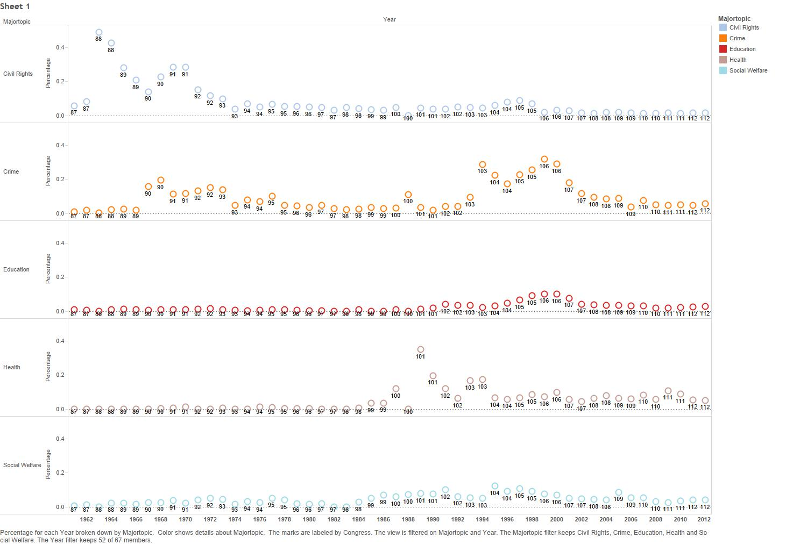
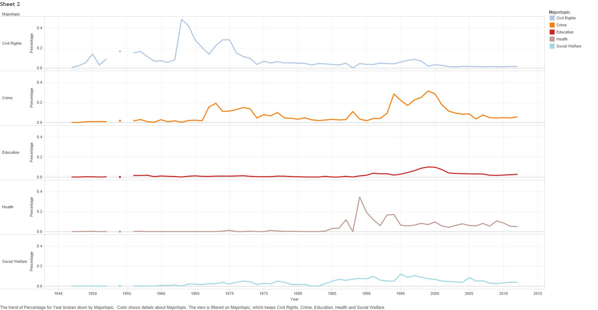

##Our Dataset
The dataset codes public opinion polls from Gallup's Most Important Problem Survey using the Policy Agendas Project's content coding scheme. The data is in the yearly format. All the entries are coded by the policy content of the poll responses, along with other variables of interest. This allows researchers to trace activity on a particular topic over time.

##Percentages of Public Opinion Topics in the 2000s
This worksheet captures the aggregated proportions for each major category, on an
annual basis, for all of the polls contained in the working data set. These annualized proportions were constructed by normalizing the percentage of responses in every major topic (e.g. Macroeconomics) by the total percentage of responses in any given year

For this particular visualization, we constructed a bar chart that showed the percentages of each major topic as a portion of the whole over the years 2000-2012 (in 2-year increments). We can see that there are some topics that public opinion does not seem to heed at all in this millenium, such as agriculture, housing and development, public lands, and transportation. Public opinion views most of the topics differently refelecting the circumstances that surround that year. For example, it's interesting to note that Defense has a significantly higher percentage in 2002 (following the 9/11 attacks) than it does in 2012. Similarly, if we compare Macroeconomics in 2006 and 2008, you can see that 2008 has a significantly higher percentage because of the Financial Crisis.

##Percentages of Major Topics during 1990-2010
We made another bar chart visualization to show a more big picture view of the 20-year period of 1990-2010 (in 5-year increments). We inserted reference lines in each pane to show that average of that topic over that time period. (For this visualization, we took out the topics that had 0%.) We also colored the bars by Percentage so that it was easier to spot the trends. The biggest fluctuations in public opinion occured with the topics: Crime and Defense. The most constantnly significant topic was Macroeconomics, which is now the highest it has ever been.

##Percentages of Social Issue Major Topics 1950 - 2010
We mae a scatterplot and a line graph portraying the Most Important Problem from Gallup's survey, specifically for topics related to social issues: Civil Rights, Crime, Education, Health, and Social Welfare.

The two visualizations portray several important trends: we can clearly see that Civil Rights was an extremely important issue up until 1975, when other issues began to take precedence.

Crime and Civil Rights both neared 0.2% 1965 - 1970, indicating a correlation. 

Education and Crime both showed a spike in importance near the year 2000, when Social Welfare was also on the rise. Both topics could have risen in importance due to people's assumption that an increase in education funding would, in turn, decrease Crime and would lessen the need for Social Welfare.

Finally, though one would think that Health would be closely correlated with these other Social topics, it actually shows a somewhat different trend: Health peaks as a topic in 1989, not correlated with the peak of any other topics, and it lessens in 1995, as soon as Crime skyrockets in importance. 

Towards the 2000s, Education, Health, Social Welfare, and Crime all experience a similar slight uptrend, while Civil Rights stays dormant. These trends altogether demonstrate the rising and falling of these different social issues' importance, and how they mostly fluctuate at similar times.

